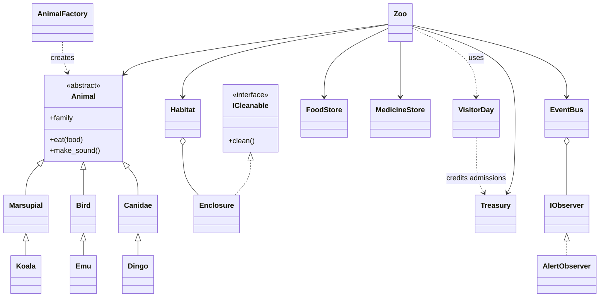

# Luminara Zoo (NIT2112)

Victoria University — **Final Assignment**: object-oriented Australian wildlife simulation.  
**Student:** Babatundji Williams-Fulwood (s8138393)

The brief’s fictional park name **“OzZoo”** is preserved in the **official unit PDF**; this submission uses the branding **Luminara Zoo** for the product name while keeping `OzZooBaseException` as the **root exception class name** so it still matches your written Tutorial and AI Copilot log.

## API keys and secrets

- Put real keys only in a local **`.env`** file (never in chat, issues, or commits).
- This repo includes **`.gitignore`** rules so `.env`, virtualenvs, `__pycache__`, **`.hermes/`**, and **`.cursor/`** stay out of version control; **`.env.example`** lists names only (no real secrets).
- If a key was ever pasted somewhere public, **revoke it** in the provider’s console and create a new one.

**Before you push or zip for submission:** run `git status` and confirm **`.env`** is not staged. If `.env` was committed earlier, stop tracking it without deleting your local file: `git rm --cached .env`. Keep **`.gitignore`** at the **repository root** so it applies to all packages (`animals/`, `zoo/`, etc.).

### Optional AI advisor (menu 16)

- **Not required** to play: the simulation is 100% manual via existing menus.
- Install: `pip install -r requirements-ai.txt` or `pip install -e ".[ai]"`.
- You must choose menu **16**, type **`YES`** in capitals, then pick **OpenAI** or **Gemini**. Limits: per in-game-day call cap, cooldown, and max output tokens (see `.env.example`).
- **Awards** (menu **17**) unlock from gameplay only — not from AI.

## How to run

Python **3.11+**:

```bash
python main.py
```

After `pip install -e .`:

```bash
luminara
# legacy alias still works:
ozzoo
```

**Optional Rich tables** (recommended in your Tutorial):

```bash
pip install -r requirements-rich.txt
# or: pip install -e ".[rich]"
```

## Does the code match your Tutorial / AI log PDFs?

**Partially — they describe a different file layout and a few extra systems** (e.g. `animals/base.py`, `zoo/entities.py`, `systems/patterns.py`, a separate `MedicineStore`, `Habitat`, Rich-only dashboard, extra Hermes helpers). **This repository is the runnable source of truth** and is **stronger on separation of concerns** (packages per concern) and **thread-safe singletons**, but **your PDFs should be updated** so assessors see:

| Topic | Your PDF says | This repo |
|-------|----------------|-----------|
| Packages | `base.py`, `entities.py`, `patterns.py` | `animals/*.py`, `zoo/zoo.py`, `zoo/enclosure.py`, `systems/*.py` |
| Win rule | Reputation ≥80 + funds, **30-day streak** | Implemented (`reputation_score`, streak, death resets streak) |
| Starter zoo | $75k + Kiki, Karl, Joey, Sheila, Digger, Aria, Rex | `apply_luminara_starter_scenario()` + CLI prompt |
| Financial ledger | Last ~15 transactions | `Treasury.ledger_entries()` + menu **13** |
| Rich | Recommended | Used automatically if `rich` is installed |
| Hermes skills | Extra JSON helpers in the log draft | `get_zoo_status`, `feed_animal`, `advance_day` (extend as needed) |

**Neither is universally “better”**: the code is more modular; your documents are fine if you **synchronise** them to this tree and menu (or paste updated file-structure + UML from `README` below).

## Assessment alignment (unit rubric)

**Authoritative mapping:** `docs/NIT2112_SUBMISSION_SOURCEBOOK.md` — requirement-by-requirement traceability to files, honest scope notes (e.g. CLI-only; enclosures fixed at startup; donations via celebration events), submission checklist, and pointers for your **Tutorial** and **AI Copilot** PDFs. **`docs/AI_COPILOT_LOG_TEMPLATE.md`** is a blank structure for the log (**you** fill real prompts and analysis).

## Design patterns (Gamma et al., 1994)

- **Singleton:** `Zoo`, `FoodStore`, `MedicineStore`
- **Factory:** `AnimalFactory`
- **Observer:** `EventBus` + `AlertObserver` + `IObserver`
- **Façade (Tutorial wording):** `Habitat` groups `Enclosure` instances into named zones (e.g. Bushlands) without duplicating compatibility rules.

## UML (Mermaid — paste into Tutorial)

Simplified for readability; add or remove classes to match what you explain in text. Export from [Mermaid Live Editor](https://mermaid.live) to PNG/PDF for your Tutorial.



## Hermes (optional)

```bash
pip install -r requirements-hermes.txt
```

Nous Research. (n.d.). *Hermes Agent*. https://github.com/NousResearch/hermes-agent

## References (APA 7th)

Gamma, E., Helm, R., Johnson, R., & Vlissides, J. (1994). *Design patterns: Elements of reusable object-oriented software*. Addison-Wesley.

Martin, R. C. (2017). *Clean architecture: A craftsman’s guide to software structure and design*. Prentice Hall.
